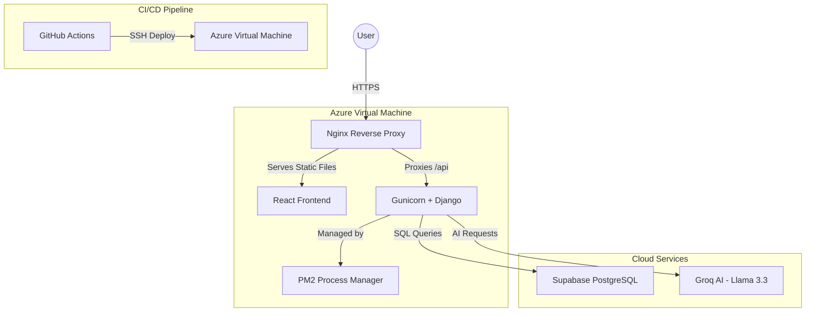

# 🚀 CareerBoost AI Dashboard

**An Enterprise-Grade AI Platform for Resume Optimization and Career Matching.**

Welcome to the **CareerBoost AI Dashboard** repository. This platform leverages professional-grade AI (Llama 3.3 via Groq) to analyze resumes, provide scored feedback, and recommend matching career paths in real-time.

---

## 🏗️ System Architecture

The project is built using a modern, decoupled architecture designed for high performance, security, and scalability.

---

## 🛠️ Tech Stack

### Frontend
- **Framework**: React 18 + TypeScript
- **Stying**: Tailwind CSS + Framer Motion
- **State Management**: React Query
- **Build Tool**: Vite

### Backend
- **Framework**: Django REST Framework (DRF)
- **Database**: Supabase (PostgreSQL)
- **AI/NLP**: Groq API (Llama 3.3), scikit-learn, FAISS, PyMuPDF

### Infrastructure
- **Hosting**: Azure Virtual Machine (Ubuntu)
- **Web Server**: Nginx
- **Process Manager**: PM2
- **Automation**: GitHub Actions
- **Security**: Let's Encrypt (SSL/HTTPS)

---

## 📂 Project Structure

- **`nexthire/frontend/`**: The React application.
- **`nexthire/backend/`**: The Django REST API.
- **`.github/workflows/`**: Automated CI/CD deployment pipeline.

---

## 🚤 Getting Started

### Local Development
1. Clone the repository.
2. Configure your `.env` files in both `frontend/` and `backend/` directories.
3. Use `npm install && npm run dev` for the frontend.
4. Use `pip install -r requirements.txt && python manage.py runserver` for the backend.

For detailed setup, see the **[NextHire Directory](file:///c:/Users/Diksha/Downloads/careerboost-ai-dashboard-main/nexthire/README.md)**.

---

## 🌍 Production
The application is live at: **[http://hire-next.duckdns.org](http://hire-next.duckdns.org)** 

---

## 📝 License
This project is licensed under the **MIT License**.

---

## 📬 Contact
**Diksha Malusare**  
GitHub: [@dikshaa120903](https://github.com/dikshaa120903)  
Email: [dikshaamalusare@gmail.com](mailto:dikshaamalusare@gmail.com)
